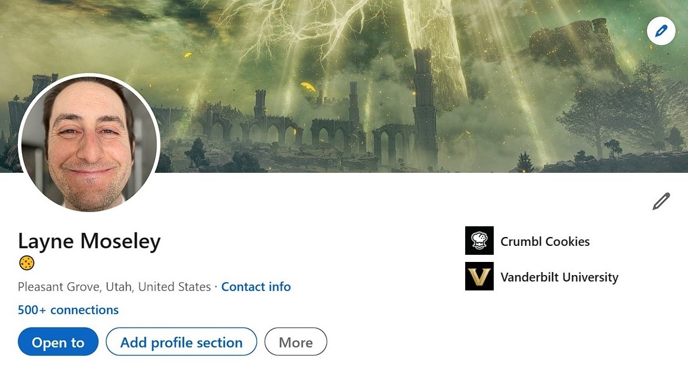
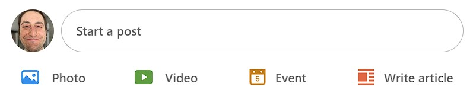

# Topic 3: Programming Assignment 2

In this assignment, you will practice breaking down a UI (User Interface) into a list of components. You will then create those components in a React application.

You will use your `professional-network` repository. Make sure to merge your pull request from the previous week before getting started.

### Requirements

- After you have downloaded this file, place it in your `professional-network` repository in the `projects` directory. Place the `t3-pa2-assets` directory in `projects` as well.
- Create a branch called **t3-pa2** and switch to the new branch.
- In the **root directory** of your repository, create a new React project with the following command: `npm init react-app frontend`, as [described here](https://create-react-app.dev/docs/getting-started#npm).
- `npm install react-icons`
- In **frontend/src** create a `components` directory.
- In the `components` directory, create 2 top level components, which will match the provided screenshots.
  - **ProfileHeader.jsx**
  - **PostPrompt.jsx**
- Build the two top level components based on the following guidelines 👇🏼:
  - **ProfileHeader.jsx**
    - Required sub components: AvatarImage, BackgroundImage, ProfileInfo, RecentExperience
      - ProfileInfo is all of the information underneath the AvatarImage
      - RecentExperience is shown on the right side of the header (Crumbl Cookies, etc)
  - **PostPrompt.jsx**
    - Required sub components: AvatarImage, InputTextField, PhotoButton, VideoButton, EventButton, etc.
    - Use [React Icons](https://www.npmjs.com/package/react-icons) for the post icons.
- Once your two top level components are complete, render them in `App.jsx`.
- Install [React Material UI](https://mui.com/): `npm install @mui/material @emotion/react @emotion/styled`
- Using the Avatar component from the [React Material UI Library](https://mui.com/material-ui/), replace all instances of `AvatarImage` in your components.

### Stretch Challenge

- Using the `Button` component from the [React Material UI Library](https://mui.com/material-ui/), replace all other Button components you created previously.

### Notes

- Create all of your components, using [this guide](https://beta.reactjs.org/learn/your-first-component) as an example.
  - As shown in the guide, your components should be a function that returns `JSX`.
- Remember that this is a programming assignment, meaning you should spend the majority of your time writing React components. Styling is important, but you will not get extra points for perfect styling
- `App.js` shouldn't have any html tags in it, it should only contain the components you create.
- Components can be embedded inside other components.

# Screenshots

#### Screenshot One

#### Screenshot Two

